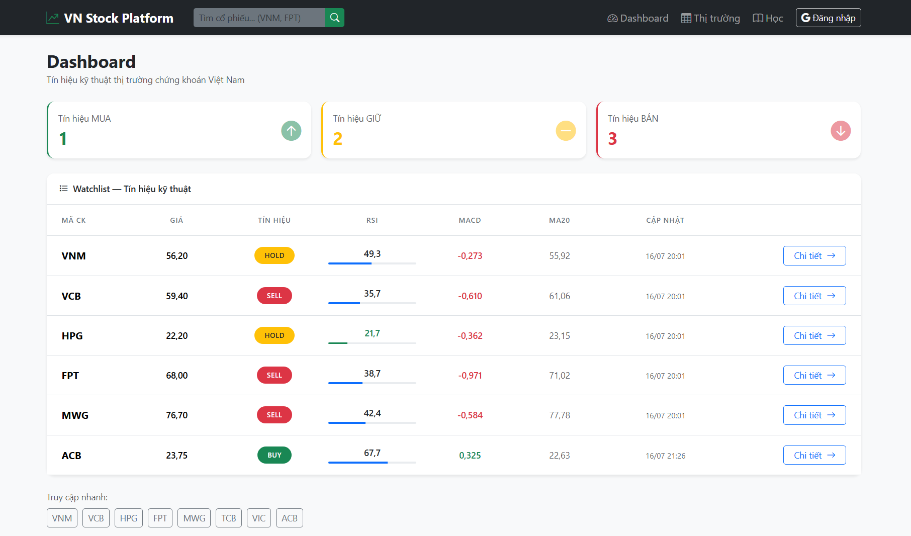
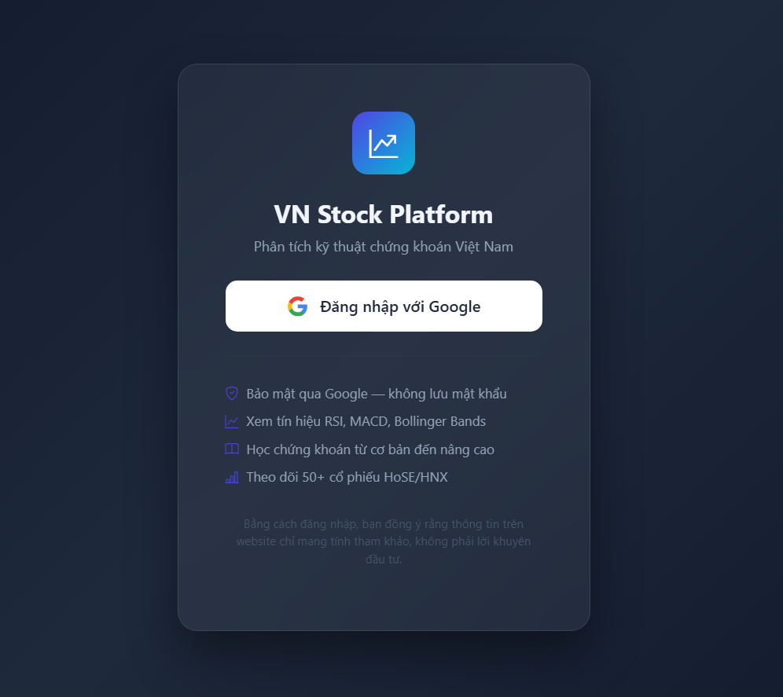
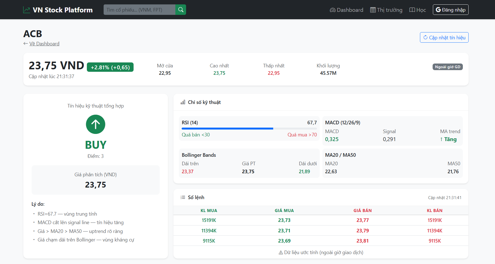
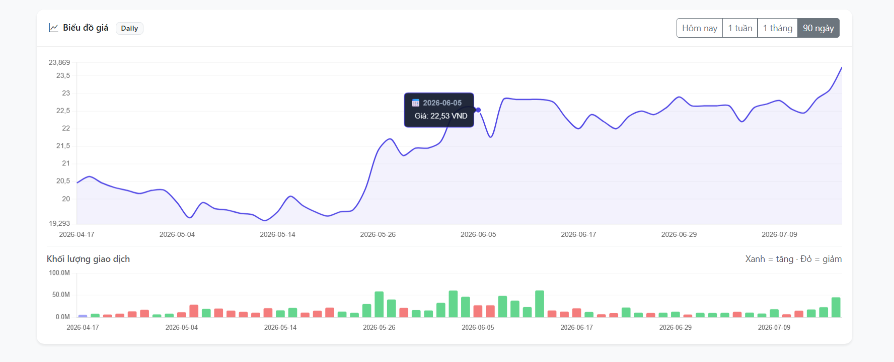
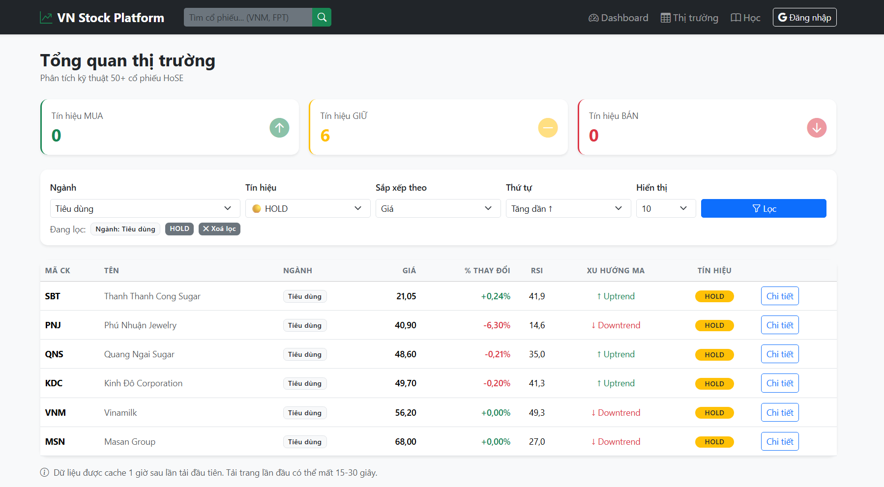
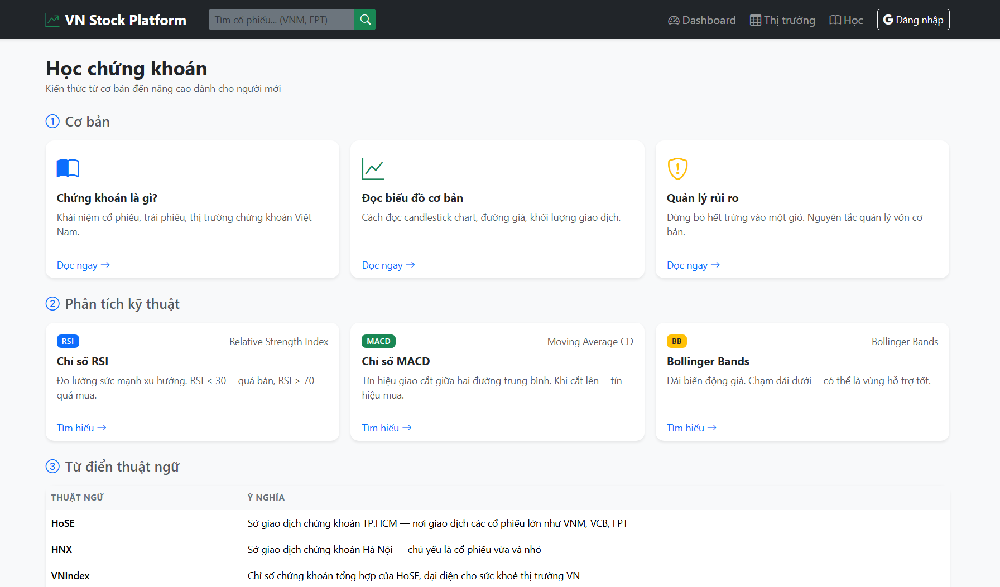

<div align="center">

# VN Stock Platform

### Technical Analysis Platform for Vietnamese Stock Market

A full-stack web application for analyzing Vietnamese stocks using technical indicators such as **RSI**, **MACD**, **Moving Average**, and **Bollinger Bands**.

Built with **Spring Boot**, **FastAPI**, **VNStock**, and **Bootstrap 5**.


---

> **Educational project only.**
>
> This platform is intended for learning technical analysis and software engineering.
> It **does not provide financial or investment advice.**

</div>

---

# Features

## Dashboard

- Real-time watchlist
- BUY / HOLD / SELL recommendation
- Daily technical signals
- Market overview

---

## Technical Indicators

Supports multiple indicators:

- RSI (14)
- MACD (12/26/9)
- Moving Average (20 / 50)
- Bollinger Bands (20)

Each indicator contributes to a scoring system used to generate recommendations.

---

## Interactive Stock Charts

- Today, 1-week, 1-month and 90-day historical prices
- Volume
- Technical overlays
- Responsive charts

---

## Search

Search stocks by:

- Stock symbol
- Company name

---

## Learning Center

Built-in tutorials:

- RSI
- MACD
- Bollinger Bands
- Technical Analysis Basics

Designed for beginners entering the Vietnamese stock market.

---

## Automatic Data Update

Scheduler automatically refreshes market data after a certain time.

---

# Screenshots

## Dashboard

<p align="center">

</p>

---

## User Authentication

Secure authentication powered by **Google OAuth2**.

Features:

- Sign in with Google
- Secure OAuth2 authentication
- Personalized user session
- Protected features for logged-in users

---

## Google Login

<p align="center">
    
</p>

---

## Stock Detail

<p align="center">

</p>

---

## Charts

<p align="center">

</p>

---

## Stock Market

<p align="center">

</p>

---

## Learning Center

<p align="center">

</p>

---

# System Architecture

```text
                     Browser
                         │
                         ▼
               Spring Boot + Thymeleaf
                         │
          Spring Security + Google OAuth2
                         │
              User Authentication
                         │
                         ▼
                Business Services
                         │
                         ▼
                    Python FastAPI
                         │
                         ▼
                     VNStock API

Spring Boot
      │
      ▼
 MySQL / H2 Database
```

---

# Technology Stack

## Backend

- Spring Boot
- Spring Security
- OAuth2 Client
- Java 17
- Maven

## Python Service

- FastAPI
- VNStock
- Pandas
- NumPy

## Frontend

- Thymeleaf
- Bootstrap 5
- JavaScript
- Chart.js

## Database

- MySQL
- H2

## Tools

- VS Code
- Git
- GitHub

---

# Project Structure

```
VN-Stock-Platform/

├── spring-service/
│   ├── controller/
│   ├── service/
│   ├── repository/
│   ├── entity/
|   ├── security/
│   ├── templates/
│   └── static/
│
├── python-service/
│
├── images/
│
└── README.md
```

---

# Getting Started

## Prerequisites

- Java 17+
- Maven
- Python 3.10+
- MySQL (optional)

---

## Clone

```bash
git clone https://github.com/Linh-N20/VN-Stock-Platform.git

cd VN-Stock-Platform
```

---

## Environment Variables

Before running the project, create a `.env` file from the example:

```bash
cp .env.example .env
```

Then update the values inside `.env`.

---

## Start Python Service

```bash
cd python-service

pip install -r requirements.txt  # Only for first run

uvicorn main:app --reload
```

Open

```
http://localhost:8000/docs
```

---

## Start Spring Boot

```bash
cd spring-service

mvn spring-boot:run
```

Open

```
http://localhost:8080
```

---

# Recommendation Logic

Each technical indicator contributes a score.

| Indicator | Signal | Score |
|-----------|--------|------:|
| RSI | Oversold | +2 |
| RSI | Overbought | -2 |
| MACD | Bullish Cross | +2 |
| MACD | Bearish Cross | -2 |
| MA20 > MA50 | Uptrend | +2 |
| Price touches Lower BB | +1 |
| Price touches Upper BB | -1 |

Final decision:

| Score | Recommendation |
|------:|---------------|
| ≥ 3 | BUY |
| -2 ~ 2 | HOLD |
| ≤ -3 | SELL |

---

# Future Improvements

- Favorite Stocks
- Portfolio Tracking
- AI News Summary
- Candlestick Pattern Detection
- Email Alerts
- Docker Deployment
- Kubernetes Deployment
- CI/CD Pipeline

---

# 📌 Roadmap

- [x] Dashboard
- [x] Technical Indicators
- [x] Chart Visualization
- [x] Learning Center
- [x] Scheduler
- [x] User Login
- [ ] Portfolio Management
- [ ] AI Recommendation
- [ ] Docker
- [ ] Deployment

---

# Contributing

Pull Requests are welcome.

For major changes, please open an issue first to discuss your ideas.

---

# Disclaimer

This project is developed for educational purposes only.

The generated BUY/HOLD/SELL signals are based on predefined technical rules and should **not** be considered investment advice.

Always perform your own research before making financial decisions.

---

# Author

**Nguyễn Thùy Linh**

Computer Science Student

Ho Chi Minh City University of Technology (HCMUT)

---

<div align="center">

⭐ If you found this project interesting, consider giving it a star!

</div>